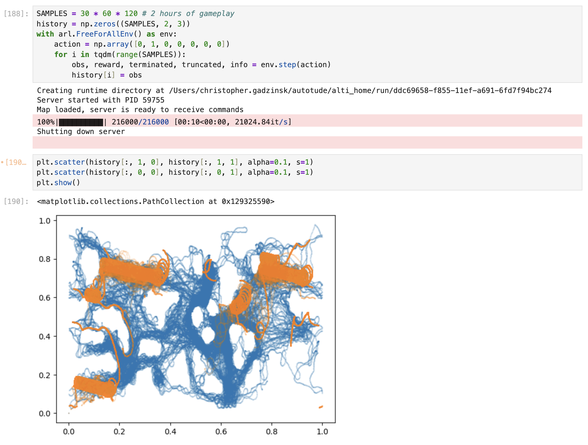

# Autotude

[Altitude](https://altitudegame.com/) is a 2d multiplayer game, released in 2009 by Nimbly Games.

This repository is my ongoing attempt to make Altitude a nice environment for reinforcement learning in my (super limited) free time.

So far, we have:

- `proto/`: A protobuf schema that can stream game state at around 12 kbps (raw) or 3 kbps (gzipped).
- `rust_src/`: Various tools to extract features from replay files.
- `hx_src/`: An in-browser replay viewer.
- A headless Altitude client that can connect to online servers and stream game state/accept controls from an external process.
- `altistats.com/`: An [online database](http://altistats.com) of human replays, recorded using the headless client.
- A "bot server" that can plays externally-controlled bots against each other at faster than realtime. (With two bots on a large map, the game can run at least 8 minutes of gameplay per realtime second.)
- `rl/`: A `gymnasium` style environment for controlling the bot server.

# Quickstart

## Dependencies

Use direnv to load environment variables from `.envrc`. Run `just nix` to build `etc/nix.env` if you'd like to manage Haxe, Java and protoc through nix.

## Testing RL environment

If you have the `bot-server` branch of the Altitude source tree, point to it with `ALTI_SRC`—for example by adding a line `etc/dev.env`. Then `cd rl` and run `just benchmark` to run the bot server without a controller attached. With rust installed, run `just index` to build an index of the replays being generated, and run `just viewer` to view the replays in your browser.

## Using RL environment



# Project Structure

## `altistats.com/`

Source for site, including docker compose configuration.

- `altistats.com/site`: sveltekit source for [http://altistats.com].

## `proto/`

Protobuf message format used to serialize game state, game inputs, and geometry of game objects.

I've patched Altitude (not fully open source) to serialize game state to a stream of `Update` messages. An `Update` is roughly a screenshot of _all_ game-relevant state at a given moment in time besides map geometry. This ncludes information not normally available to a player like positions of off-screen planes, powerups held by enemies, and exact health/energy values of all planes.

Once gzipped, streaming a game as a series of `Update` messages (see `proto/update.proto`) is roughly as efficient as the netcode used by the game but much less arcane. Most importantly, `Updates` don't require the reader to simulate any parts of the game, and provide all "game objects" as .

A replay (extension `.pb`) is just a gzipped sequence of length-delimited `Update` messages.

The bandwidth of a game with 8 players (like 4v4 ball) tends to be about 0.2 megabytes per minute after gzipping, or roughly 100x less than the bandwidth of 720p video.

## `data/polys`

Map geometry is sent in the first `Update` message when a game begins. Besides map geometry, the only additional information needed to interpret an `Update` are the relative hitboxes of game objects like planes and projectiles. `data/polys` is a gzipped sequence of length-delimited `Poly` messages (as defined in `proto/poly.proto`) giving the hixboxes of different game objects. This data is read from `poly_src`, an bunch of XML files copied from Altitude.

Planes have different hitboxes depending on their "roll." The degrees of roll for which hitboxes are available are irregularly distributed.

## `hx_src/`

Haxe soure. Mainly the replay viewer, written with the heaps game engine.

## `rust_src/`

Rust source for the indexer (`bin/index`) used to dump replays into a DuckDB database.

## `viewer/`

A web application for browsing and viewing replay files. The app reads from a DuckDB database created by the indexer and provides a web interface to browse and launch replays in the viewer.

To run the viewer:
1. Make sure you have indexed some replays with `bin/index`
2. Set the `DATA_DIR` environment variable to point to your data directory
3. Create and activate the conda environment:
   ```bash
   mamba env create -f environment.yml
   mamba activate alti
   ```
4. Run `python viewer/app.py`
5. Open http://localhost:5000 in your browser
